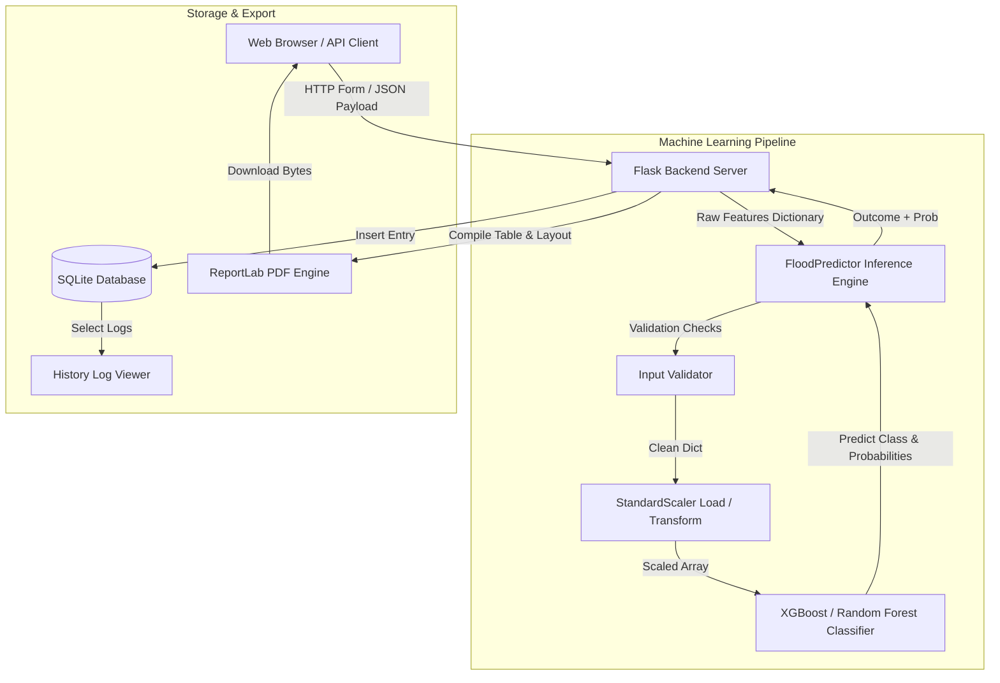

# Rising Waters: A Machine Learning Approach to Flood Prediction

An industry-grade, end-to-end Machine Learning web application designed to predict localized flooding risk based on climate, rainfall, and hydrology metrics. The project features automated exploratory data analysis, hyperparameter tuning, local database logging, CSV upload for bulk predictions, REST API interface, and dynamic PDF report exporting.

---

## 🏗️ System Architecture

The following diagram illustrates the data flow from client inputs through preprocessing, classification model prediction, SQL database logging, and PDF generation.



---

## 🌟 Key Features

1. **Robust Preprocessing Pipeline**: Handles missing data imputation, duplicate record identification, and out-of-bounds capping using the IQR method.
2. **Hyperparameter Tuning**: Utilizes `GridSearchCV` to optimize parameters for Decision Tree, Random Forest, K-Nearest Neighbors, and XGBoost models.
3. **Interactive Visual Dashboard**: Compares ROC Curve metrics and confusion matrices across models, alongside detailed EDA distribution and box plots.
4. **Interactive SVG/CSS Gauge**: Displays a colored safety-to-alert risk probability gauge on classification outcomes.
5. **Local Prediction Logs**: Persists history in SQLite. Supports row deletions or database purging.
6. **Dynamically Export Reports**: Generates and downloads professional letter-sized PDF safety briefs using ReportLab.
7. **REST API Interface**: Exposes a `/api/predict` JSON endpoint for automation and scaling.
8. **Responsive Dark Mode**: Features custom theme switches using local storage states.

---

## 📊 Dataset Features

The classification models are trained on environmental features representing real-world physical thresholds:
- **River Level (m)**: Standard gauge height of local rivers (critical predictor).
- **Seasonal Rainfall (mm)**: Total volume during the current rain cycle.
- **Monsoon Intensity (Scale 1-10)**: Regional monsoon system strength.
- **Humidity (%)**: Relative atmospheric moisture level.
- **Annual Rainfall (mm)**: Long-term cumulative precipitation.
- **Average Rainfall (mm)**: Baseline expected rainfall.
- **Cloud Visibility (%)**: Visual cloud-cover indices.
- **Wind Speed (km/h)**: Regional air speed.
- **Temperature (°C)**: Celsius surface temperature.
- **Pressure (hPa)**: Atmospheric air pressure.
- **Flood Label (Target)**: `1` (Flood Expected), `0` (No Flood Expected).

---

## 📂 Folder Structure

```
Flood-Prediction/
│
├── app.py                      # Main Flask Application
├── generate_data.py            # Synthetic dataset generator
├── preprocess.py               # OOP Data Preprocessor & StandardScaler fit
├── model_training.py           # Model tuning (GridSearchCV), evaluations & plots
├── prediction.py               # ML Inference module for single & batch requests
├── database.py                 # SQLite database query manager
│
├── dataset/
│      └── flood.csv            # Pre-training CSV dataset
│
├── models/
│      ├── model.pkl            # Serialized best performing classifier
│      ├── scaler.pkl           # Serialized StandardScaler instance
│      └── results_summary.pkl  # Compiled classification performance metrics
│
├── static/
│      ├── css/
│      │    └── style.css       # Custom styles, dark theme, gauges & spinners
│      ├── js/
│      │    └── main.js         # Theme selectors & animation controllers
│      └── images/              # Generated EDA & Evaluation png plots
│
├── templates/
│      ├── base.html            # Standard application wrapper
│      ├── index.html           # Marketing home page
│      ├── predict.html         # Analysis parameters form
│      ├── result.html          # Individual risk outcome gauge
│      ├── dashboard.html       # Dynamic metrics & chart gallery
│      ├── history.html         # SQLite query list
│      ├── batch.html           # Bulk CSV upload panel
│      ├── 404.html             # Page not found error view
│      └── error.html           # Internal 500 error display
│
├── notebooks/
│      └── Flood_EDA.ipynb      # Complete EDA Jupyter Notebook
│
├── requirements.txt            # Package dependencies list
├── runtime.txt                 # PaaS runtime engine version
├── Procfile                    # PaaS process execution commands
└── README.md                   # System documentation
```

---

## 🛠️ Local Installation & Run

1. **Clone project repository**:
   ```bash
   git clone <repository-url>
   cd Rising_water
   ```

2. **Create and Activate Virtual Environment**:
   ```bash
   python -m venv venv
   # On Windows
   venv\Scripts\activate
   # On Linux/macOS
   source venv/bin/activate
   ```

3. **Install dependencies**:
   ```bash
   pip install -r requirements.txt
   ```

4. **Generate dataset & train model**:
   ```bash
   python generate_data.py
   python model_training.py
   ```
   *This creates directory structures, fills `dataset/flood.csv`, performs hyperparameter search, writes models to `models/`, and outputs visual graphs to `static/images/`.*

5. **Start Flask web server**:
   ```bash
   python app.py
   ```
   *Access the web console locally at `http://localhost:5000`.*

---

## ☁️ Deployment Instructions

### 1. GitHub Setup
Initialize Git and push your changes to your remote repository:
```bash
git init
git add .
git commit -m "Initial commit of Rising Waters Flood Prediction project"
git branch -M main
git remote add origin <github-repo-url>
git push -u origin main
```

### 2. IBM Cloud Deployment
You can deploy this application easily to IBM Cloud Foundry or IBM Cloud Code Engine:

#### Code Engine Deployment
1. Log in to IBM Cloud CLI:
   ```bash
   ibmcloud login --sso
   ibmcloud target -g <resource-group-name>
   ```
2. Build and push your Docker image to IBM Cloud Container Registry (ICR) or deploy directly from the GitHub repository source code:
   ```bash
   ibmcloud ce app create --name rising-waters --build-source . --port 5000
   ```
   *The `Procfile` and `runtime.txt` will automatically guide the buildpack to run `gunicorn app:app`.*

---
